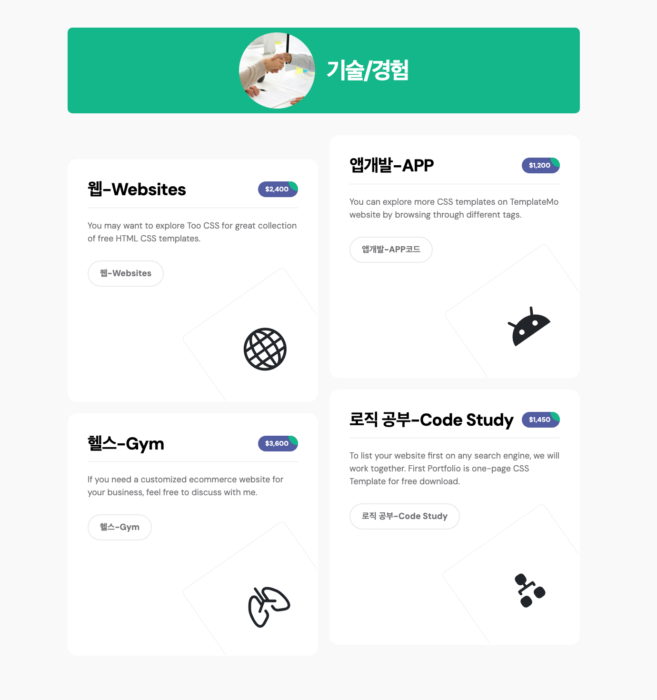

# SPRING

> # 스프링 부트 프로젝트 시작! (학번 :20230987 이름 : 노대영 )
>
> 매 주 수업 내용을 정리하자.

성결대학교 자바웹프로그래밍(2) 실습 저장소

| 항목        | 내용                   |
| ----------- | ---------------------- |
| IDE         | VS Code                |
| 언어 / JDK  | Java 25 (최소 17 이상) |
| 프레임워크  | Spring Boot 4.1.1      |
| 빌드 도구   | Maven                  |
| 템플릿 엔진 | Thymeleaf              |
| 내장 WAS    | Apache Tomcat (8080)   |

실행 : `./mvnw spring-boot:run` → http://localhost:8080

---

# 2주차 수업 내용

## 1. 스프링 부트란

### 스프링 프레임워크에서 스프링 부트로

2004년에 나온 스프링 프레임워크는 오픈소스 기반의 대표 웹 프레임워크지만, 모든 설정을 XML로 직접 작성해야 해서 **진입 장벽이 매우 높았다.** 이 문제를 해결하려고 2014년에 등장한 것이 스프링 부트다.

| 구분      | 스프링 프레임워크 (2004) | 스프링 부트 (2014)  |
| --------- | ------------------------ | ------------------- |
| 설정      | XML 기반 수동 설정       | **자동 환경설정**   |
| 진입 장벽 | 매우 높음                | 낮음                |
| 서버      | 외부 WAS 별도 설치       | **WAS 내장**        |
| 빌드      | 수동                     | 자동 빌드 및 리로드 |

스프링 부트는 스프링을 **대체한 것이 아니라 감싼 것**이다. 아래에 스프링이 그대로 있고, 그 위에서 설정을 자동화해 준다.

> **비유** — 스프링이 재료를 하나하나 직접 손질하는 것이라면, 스프링 부트는 재료를 믹서기에 넣고 버튼만 누르는 것이다.

**핵심 정리**

- 스프링 부트의 핵심은 **작은 규모 및 단순 서블릿 관리**
- 자바 언어로 작성되어 **JVM 위에서 실행**된다
- 주요 기능은 **자동 환경설정**, 자동 빌드 및 리로드

### 전자정부 표준 프레임워크 (eGov)

스프링을 기반으로 2010년 이후 공개된, 국내 공공기관 웹 프로젝트의 표준이다. 요구 기술은 **자바, JSP, jQuery, eGov**이며 최근 스프링 부트 지원이 시작되었다.

프레임워크를 쓰는 이유는 다음 8가지로 정리된다.

| 개발 용이성     | 시스템 복잡도 감소    | 이식성          | 품질보증                   |
| --------------- | --------------------- | --------------- | -------------------------- |
| **운영 용이성** | **개발코드의 최소화** | **변경 용이성** | **설계와 코드의 재사용성** |

---

## 2. 개발 환경 설정

### 2-1. VS Code 확장 모듈

직접 검색해서 설치한 뒤 **VS Code를 재시작**해야 적용된다.

| 설치할 확장 팩                 | 자동으로 함께 추가되는 확장                                                                                                         |
| ------------------------------ | ----------------------------------------------------------------------------------------------------------------------------------- |
| **Extension Pack for Java**    | Visual Studio IntelliCode, Language Support for Java, Debugger for Java, Maven for Java, Java Test Runner, Project Manager for Java |
| **Spring Boot Extension Pack** | Spring Boot Tools, Spring Initializr Java Support, Spring Boot Dashboard, Cloudfoundry Manifest YML, Concourse CI Pipeline Editor   |

### 2-2. JDK 환경 설정

자바 연동에 문제가 생긴 경우에만 하면 된다.

`파일 → 기본설정 → 설정` → 검색창에 **java home** 입력 → **`settings.json`에서 편집** 클릭 → 경로 **2개**를 직접 추가한다.

```jsonc
// Windows — 백슬래시를 이스케이프해야 함
{
  "spring-boot.ls.java.home": "C:\\Program Files\\Java\\jdk-25.0.2",
  "java.jdt.ls.java.home": "C:\\Program Files\\Java\\jdk-25.0.2",
}
```

```jsonc
// macOS — 이 저장소의 실제 설정
{
  "spring-boot.ls.java.home": "/opt/homebrew/opt/openjdk@25/libexec/openjdk.jdk/Contents/Home",
  "java.jdt.ls.java.home": "/opt/homebrew/opt/openjdk@25/libexec/openjdk.jdk/Contents/Home",
}
```

> **주의** — 설치된 JDK의 **버전 경로를 정확히** 확인할 것

### 2-3. 새 프로젝트 만들기 (Spring Initializr)

팔레트 `Ctrl + Shift + P` → **spring maven** 입력 → `Spring Initializr: Create a Maven Project`

| 단계 | 선택                                  |
| ---- | ------------------------------------- |
| 1    | 스프링 부트 버전 : **4.x**            |
| 2    | 프로젝트 그룹 : `com.example`         |
| 3    | 패키징 : **Jar**                      |
| 4    | 언어 : 자바 / 자바 버전 : **25**      |
| 5    | 의존성 **7가지** 선택                 |
| 6    | 새 폴더를 생성한 뒤 지정              |
| 7    | 하단 알림에서 **Open** → 폴더 신뢰 OK |

선택할 의존성 7가지

| 분류             | 의존성                          |
| ---------------- | ------------------------------- |
| Developer Tools  | Spring Boot DevTools, Lombok    |
| Web              | Spring Web, Spring Web Services |
| Template Engines | Thymeleaf                       |
| SQL              | Spring Data JPA, MySQL Driver   |

> **주의** — 폴더 경로에 **한글이 들어가면 안 된다.**

프로젝트가 열리면 하단에 뜨는 설정 알림을 **모두 수락**한다.

---

## 3. 프로젝트 폴더 구조 (Maven)

```
spring
├── .mvn                                # Maven Wrapper
├── .vscode                             # VS Code 설정
├── src
│   ├── main
│   │   ├── java/com/example/demo       # 루트 패키지 경로
│   │   │   ├── DemoApplication.java    # 프로그램 시작점
│   │   │   └── DemoController.java     # URL 매핑 담당
│   │   └── resources
│   │       ├── static                  # css, 이미지, js 등
│   │       ├── templates               # Thymeleaf 템플릿 (뷰)
│   │       └── application.properties  # 애플리케이션 환경 설정
│   └── test                            # 테스트 코드 (실행하면 생성됨)
├── target                              # 빌드 산출물
└── pom.xml                             # 빌드 및 종속성 설정
```

기억할 점

- **`src → main → java`** 가 루트 패키지 경로다
- **패키지 = 폴더 구조**로 프로젝트를 구분하는 단위
- 빌드 도구는 **Gradle**과 **Maven**이 있으며, Maven은 기존 레거시에 적합하고 소규모 프로젝트에서 많이 쓰인다

---

## 4. 자바 클래스 파일 — DemoApplication.java

`demo` 폴더 하위의 `.java` 소스파일이며, **프로그램의 시작점**이다.

```java
package com.example.demo; // 현재 폴더 위치

import org.springframework.boot.SpringApplication;              // 스프링 핵심 클래스
import org.springframework.boot.autoconfigure.SpringBootApplication; // 자동 설정 기능 활성화

@SpringBootApplication // 애노테이션(스프링 부트 APP 명시, 하위 다양한 설정을 자동 등록)
public class DemoApplication { // 클래스 이름

    public static void main(String[] args) { // 메인 메서드(프로그램 시작점)
        SpringApplication.run(DemoApplication.class, args); // run 메서드로 실행
    }
}
```

스프링 부트는 **애노테이션을 통해 자동 설정**된다. 코드 상단에 특정 역할을 명시하는 방식이다.

| 애노테이션               | 의미                                  |
| ------------------------ | ------------------------------------- |
| `@SpringBootApplication` | Spring Boot application 으로 설정     |
| `@Controller`            | View를 제공하는 controller로 설정     |
| `@RestController`        | REST API를 제공하는 controller로 설정 |
| `@RequestMapping`        | URL 주소를 맵핑                       |
| `@GetMapping`            | Http GetMethod URL 주소 맵핑          |
| `@PostMapping`           | Http PostMethod URL 주소 맵핑         |
| `@PutMapping`            | Http PutMethod URL 주소 맵핑          |
| `@DeleteMapping`         | Http DeleteMethod URL 주소 맵핑       |
| `@RequestParam`          | URL Query Parameter 맵핑              |
| `@RequestBody`           | Http Body를 Parsing 맵핑              |
| `@Valid`                 | POJO Java class의 검증                |

### JVM (자바 가상 머신)

자바 소스는 **바이트 코드**로 컴파일되고, JVM이 이를 실행/해석/JIT 컴파일한다. C#과 같이 **GC**(가비지 컬렉션)가 있어 메모리를 자동 관리한다.

```
[컴파일 타임]  Hello.java  ──javac──▶  Hello.class (바이트 코드)
[런타임]       Hello.class ──클래스 로더──▶ JVM ──▶ 운영체제 ──▶ 하드웨어
```

| 특징            | 설명                                     | 장점                          | 단점                          |
| --------------- | ---------------------------------------- | ----------------------------- | ----------------------------- |
| 플랫폼 독립성   | 운영체제나 하드웨어에 독립적으로 작동    | 어떤 환경에서도 동일하게 실행 | 초기 컴파일 과정 필요         |
| 바이트코드 실행 | 소스 코드를 바이트코드로 컴파일하여 실행 | 플랫폼 독립성 확보            | 인터프리터 또는 JIT 과정 필요 |
| 가비지 컬렉션   | 개발자가 메모리 관리를 직접 하지 않음    | 메모리 누수 방지              | 초기 성능 저하 가능성         |
| 보안            | 샌드박스 방식으로 실행                   | 시스템 보안 강화              | 복잡한 구현 필요              |
| 성능            | JIT 컴파일러 사용                        | 빠른 실행 속도                | 초기 컴파일 과정 필요         |

---

## 5. 기본 화면 실행하기

`src/main/resources/templates` 하위에 **index.html**을 생성한다. 기존 HTML5를 그대로 사용할 수 있다.

```html
<!DOCTYPE html>
<html xmlns:th="http://www.thymeleaf.org">
  <head>
    <meta charset="UTF-8" />
    <title>index 메인페이지</title>
  </head>
  <body>
    <h1>안녕하세요!</h1>
    <a href="/hello">홈페이지 메인</a>
  </body>
</html>
```

`DemoApplication.java`를 열고 메인 함수를 확인한 뒤 **디버깅 없이 실행 (`Ctrl + F5`)** 한다. 초기 로딩에 시간이 걸리므로 잠시 대기한다.

```
Tomcat initialized with port 8080 (http)
Starting Servlet engine: [Apache Tomcat/10.1.26]
Tomcat started on port 8080 (http) with context path ''
Started DemoApplication in 0.625 seconds
```

좌측 **Spring Boot Dashboard**에서 `demo [:8080]` 항목의 인터넷 아이콘을 클릭하거나, 브라우저에서 직접 접속한다.

**실행 결과 — http://localhost:8080**


### 실행 시 에러가 나는 경우

DB 관련 소프트웨어를 아직 설정하지 않았으므로, 최상단 `pom.xml`에서 DB 관련 의존성을 **주석 처리**한다. 주석 단축키는 선택 후 `Ctrl + /` 이다.

```xml
<!-- <dependency>
        <groupId>org.springframework.boot</groupId>
        <artifactId>spring-boot-starter-data-jpa</artifactId>
    </dependency> -->
```

> 이 저장소에서는 `spring-boot-starter-data-jpa`, `spring-boot-starter-data-jpa-test`, `mysql-connector-j` 를 주석 처리했다.

**왜 주석 처리해야 하나** — 스프링 부트는 시작할 때 JPA와 MySQL Driver를 발견하면 DB 접속 정보(DataSource)를 자동으로 만들려 한다. 그런데 아직 접속 정보를 설정하지 않았으므로 실패하면서 애플리케이션이 종료된다.

---

## 6. 스프링 부트 동작 과정

### 6-1. 웹 서버와 WAS

대표적인 웹 서버로 NGINX, **APACHE**, IIS 등이 있다. 웹은 **정적 웹 페이지에서 동적 웹 페이지 개발로 변화**했고, 이에 따라 DB와 서버 사이드 언어가 확장되었다.

현존하는 대부분의 웹 서버는 기본 WAS를 기반으로 다수의 서버를 연동하며, 대표적인 것이 **DB 서버**다.

```
Client ── Web Server ── WAS ── DB
```

스프링 부트 프레임워크는 **톰캣(TOMCAT)을 내장**하고 있다.

- 웹 애플리케이션 서버(WAS)
- 자바 기반 동적 웹 페이지 실행
- 오픈소스

또한 **스프링 컨테이너**가 자바 객체의 **생성, 초기화, 호출, 종료**를 관리하고 **의존성 주입(DI)** 을 수행한다.

### 6-2. DispatcherServlet 내부 동작

`DispatcherServlet`은 **프론트 컨트롤러** 역할로 페이지 요청과 응답을 처리한다.

```
1. 사용자가 /이름 형태로 URI 요청
2. DispatcherServlet → HandlerMapping 에게 매핑되는 컨트롤러 검색 요청
3. Controller 가 비즈니스 로직 수행 후 ModelAndView 반환
4. ViewResolver 가 처리 결과를 생성할 뷰를 결정
5. View(Thymeleaf)가 서버 측에서 HTML 렌더링 후 클라이언트에 응답
```

`/hello` 를 입력했을 때 실제로 일어나는 일

```
브라우저 → 내장 톰캣 → DispatcherServlet
  → HandlerMapping이 DemoController.hello() 를 찾음
  → Model에 "data" = "반갑습니다." 를 담고 "hello" 리턴
  → ViewResolver가 templates/hello.html 을 찾음
  → Thymeleaf가 ${data}를 "반갑습니다."로 치환해 HTML 완성
  → 브라우저에 응답
```

### 6-3. URI 와 URL

```
http://www.example.co.uk/seo-tools/uri-encoder?name=value
└── Domain ──┘└──────── URI ────────┘└─ Query String ─┘
```

| 용어         | 의미                                            |
| ------------ | ----------------------------------------------- |
| Domain       | 웹사이트가 호스팅된 실제 서버                   |
| URI          | 서버의 파일에 매핑되는 식별자 — 자원의 **이름** |
| URL          | 자원의 **위치**                                 |
| Query String | GET 요청으로 값을 전달하는 부분                 |

### 6-4. MVC 디자인 패턴

디자인 패턴이란 개발에 앞서 **설계 구조를 정형화한 방법론**이다.

| 구성               | 역할             | 비고                               |
| ------------------ | ---------------- | ---------------------------------- |
| **M** (Model)      | 페이지 정보 저장 | 컨트롤러가 뷰로 넘길 데이터를 담음 |
| **V** (View)       | 페이지 화면 구성 | 템플릿 엔진 : jsp, thymeleaf 등    |
| **C** (Controller) | 페이지 흐름 제어 | URL을 받아 어떤 뷰를 보여줄지 결정 |

```
                 Web request
                      ↓
                 Controller
            ↙                  ↘
   Update data              Update presentation
      Model    ◀── Get data ──   View
```

---

## 7. Thymeleaf

HTML 기반 **템플릿 엔진**으로, MVC에서 화면 출력을 담당하는 **뷰(V)** 역할을 한다. `DispatcherServlet`을 통해 동작하며 `TemplateEngine`을 내장하고 있다. HTML, XML, JS, CSS 등을 지원한다.

주요 기능은 데이터 바인딩·연산·객체 호출, 템플릿 Fragment, 전용 제어문(반복·조건) 등이다.

| 템플릿                 | Spring Boot starter dependency         |
| ---------------------- | -------------------------------------- |
| FreeMarker             | `spring-boot-starter-freemarker`       |
| Groovy templates       | `spring-boot-starter-groovy-templates` |
| JavaServer Pages (JSP) | None (provided by Tomcat or Jetty)     |
| Mustache               | `spring-boot-starter-mustache`         |
| **Thymeleaf**          | `spring-boot-starter-thymeleaf`        |

> 레거시 템플릿 엔진인 **JSP는 사용 금지**다.

### 문법

| 구분        | 문법                                                                |
| ----------- | ------------------------------------------------------------------- |
| 선언        | `<html lang="en" xmlns:th="http://www.thymeleaf.org">`              |
| 주석        | `<!--/* This code will be removed at thymeleaf parsing time! */-->` |
| 텍스트 출력 | `<span th:text="${data}"> </span>`                                  |
| 변수 표현식 | `${...}`                                                            |

### 동작 규칙

- **모든 링크는 컨트롤러를 통해 동작**한다
- URL 요청 이후 컨트롤러는 **viewName**을 리턴하고, `templates/viewName.html` 과 연결된다
- `resources/templates` 에는 뷰를, `resources/static` 에는 그 외 자원을 배치한다

---

## 8. URL 매핑과 컨트롤러

루트 폴더 하위 `demo` 폴더에 **DemoController.java** 를 생성한다. **대소문자 및 이름이 일치해야 한다.**

```java
package com.example.demo;

import org.springframework.stereotype.Controller;
import org.springframework.ui.Model;
import org.springframework.web.bind.annotation.GetMapping;

@Controller // 컨트롤러 애노테이션 명시
public class DemoController {

    @GetMapping("/hello") // 전송 방식 GET
    public String hello(Model model) {
        model.addAttribute("data", "반갑습니다."); // model 설정
        return "hello"; // hello.html 연결
    }
}
```

읽는 법

- `@GetMapping("/hello")` — 주소창에 `/hello` 를 치면 이 메서드가 실행된다
- `model.addAttribute("data", "반갑습니다.")` — 뷰로 넘길 데이터를 `data` 라는 이름으로 담는다
- `return "hello"` — 이 문자열이 **viewName**이며 `templates/hello.html` 과 연결된다

### 클래스 이름 작성 규칙

| 작성 규칙                               | 예                                    |
| --------------------------------------- | ------------------------------------- |
| 하나 이상의 문자로 이루어져야 한다      | `Car`, `SportsCar`                    |
| 첫 번째 글자는 숫자가 올 수 없다        | `3Car` (X)                            |
| `$`, `_` 외의 특수문자는 사용할 수 없다 | `$Car`, `_Car` / `@Car`(X), `#Car`(X) |
| 자바 키워드는 사용할 수 없다            | `int`(X), `for`(X)                    |

### 404 에러가 나는 경우

`index.html`에서 링크를 `/hello.html` 로 걸면 **Whitelabel Error Page (404)** 가 발생한다.

```
This application has no explicit mapping for /error, so you are seeing this as a fallback.
There was an unexpected error (type=Not Found, status=404).
No static resource hello.html.
NoResourceFoundException
```

`templates` 폴더의 파일은 정적 자원이 아니라 **컨트롤러를 거쳐야만** 접근된다. 따라서 링크를 파일명이 아닌 **매핑 주소 `/hello`** 로 수정해야 한다.

```html
<a href="/hello.html">홈페이지 메인</a>
<!-- ✗ 404 -->
<a href="/hello">홈페이지 메인</a>
<!-- ✓ -->
```

**실행 결과 — http://localhost:8080/hello**


`th:text="${data}"` 가 컨트롤러에서 담은 `"반갑습니다."` 로 치환되어 출력된 것이다.

### 수업 완료 시점의 URL 매핑

| URL      | 컨트롤러 메서드 | 연결 화면    | 출력                      |
| -------- | --------------- | ------------ | ------------------------- |
| `/`      | (정적 연결)     | `index.html` | 안녕하세요!               |
| `/hello` | `hello()`       | `hello.html` | 안녕하세요! / 반갑습니다. |

---

# 2주차 과제

## 문제 — URL 매핑과 컨트롤러 추가하기

1. 기존 `hello.html` 링크를 수정한다
   - 링크명 : **두번째 헬로 페이지**
   - URL 매핑으로 통일 : **`/hello2`**
2. 컨트롤러에 매핑을 추가한다
   - `hello2` 메서드를 작성하고 **5개의 속성**을 각자 추가
3. **`hello2.html`** 을 작성한다
   - 5개 속성 변수를 출력

## 풀이 순서

### 1단계. hello.html 의 링크를 수정한다

기존 링크를 `/hello2` 로 바꾸고 링크명을 "두번째 헬로 페이지"로 수정한다.

```html
<!DOCTYPE html>
<html xmlns:th="http://www.thymeleaf.org">
  <head>
    <meta charset="UTF-8" />
    <title>Hello 페이지</title>
  </head>
  <body>
    <h1>안녕하세요!</h1>
    <p th:text="${data}"></p>
    <a href="/hello2">두번째 헬로 페이지</a>
  </body>
</html>
```

여기서도 `/hello2.html` 이 아니라 **`/hello2`** 로 써야 한다. 파일명으로 쓰면 404가 난다.

**실행 결과 — http://localhost:8080/hello**


### 2단계. 컨트롤러에 hello2 매핑을 추가한다

`DemoController.java` 에 메서드를 하나 더 만든다. 속성 5개를 각각 다른 이름으로 담는다.

```java
@GetMapping("/hello2") // 2주차 연습문제 : URL 매핑 추가
public String hello2(Model model) {
    model.addAttribute("name", "홍길동님.");        // 속성 1
    model.addAttribute("greeting", "방갑습니다.");   // 속성 2
    model.addAttribute("day", "오늘.");             // 속성 3
    model.addAttribute("weather", "날씨는.");        // 속성 4
    model.addAttribute("comment", "매우 좋습니다.");  // 속성 5
    return "hello2"; // hello2.html 연결
}
```

`addAttribute("키", "값")` 으로 담은 값을 뷰에서 `${키}` 로 꺼내 쓴다. **키 이름이 서로 달라야** 5개가 모두 출력된다.

### 3단계. hello2.html 을 작성한다

담은 속성 5개를 `th:text` 로 각각 출력한다.

```html
<!DOCTYPE html>
<html xmlns:th="http://www.thymeleaf.org">
  <head>
    <meta charset="UTF-8" />
    <title>Hello2 페이지</title>
  </head>
  <body>
    <h1>안녕하세요!</h1>
    <p th:text="${name}"></p>
    <p th:text="${greeting}"></p>
    <p th:text="${day}"></p>
    <p th:text="${weather}"></p>
    <p th:text="${comment}"></p>
    <a href="/">홈페이지 메인</a>
  </body>
</html>
```

**실행 결과 — http://localhost:8080/hello2**


## 결과 정리

| URL       | 컨트롤러 메서드 | 뷰            | 전달 속성                                       | 다음 링크 |
| --------- | --------------- | ------------- | ----------------------------------------------- | --------- |
| `/`       | (정적 연결)     | `index.html`  | -                                               | `/hello`  |
| `/hello`  | `hello()`       | `hello.html`  | `data`                                          | `/hello2` |
| `/hello2` | `hello2()`      | `hello2.html` | `name`, `greeting`, `day`, `weather`, `comment` | `/`       |

화면 이동 흐름

```
/  ──▶  /hello  ──▶  /hello2  ──▶  /
```

이 과제로 확인한 것은 **컨트롤러에 매핑을 추가하는 방법**, **Model로 값을 여러 개 전달하는 방법**, 그리고 **Thymeleaf에서 변수를 출력하는 방법** 세 가지다.

---

# 3주차 수업 내용

3주차는 **부트스트랩 5 기반 포트폴리오 템플릿을 스프링 부트 프로젝트에 이식하고, 내 정보로 바꾸는 것**이 목표다.
2주차까지는 `hello.html` 같은 연습용 화면만 만들었다면, 3주차부터는 **실제로 학기말까지 계속 쓸 메인 화면**을 만들기 시작한다.

## 1. 웹 트렌드 — 웹 호스팅과 기술 스택

### 웹 호스팅의 종류

| 구분       | 내용                              | 특징                      |
| ---------- | --------------------------------- | ------------------------- |
| 일반 웹    | 카페24, 아임웹, 윅스, 가비아      | 서버의 일부(공간)만 임대, 저렴 |
| 맞춤형     | VPS 호스팅, 클라우드              | 확장 가능하지만 비용이 높음 |

- **웹 사이트의 종류** : 랜딩(원페이지) / 회사소개 / 맞춤형(쇼핑몰, 예약 등)
- **고객이 원하는 가격대** : 배포 가능한 최저가 → 확장은 고려하지 않는 경우가 많다
- **개발 전 최우선 과제** : 호스팅 및 추가 기능을 포함한 **최종 견적서**

### 스프링 부트는 어디에 적합한가?

스프링 부트는 **맞춤형 웹 서비스**에 적합하고, 그래서 **VPS/클라우드 환경이 필요**하다.
일반 웹 호스팅(카페24 저가 상품)에는 올릴 수 없다는 뜻이다.

- 우리 프로젝트 기준 환경 : **CAFE24 VPS(자바)**, 스프링 3.5 버전(JAVA 21)
- 요금제 : DEV-B, C 기준 월 66,000 ~ 132,000원
- 개발자의 고충 : **배포 시에 발생하는 문제들** (로컬에선 되는데 서버에선 안 되는 상황)

### 전체 기술 스택 흐름

```
Client(브라우저) ──HTTP Request──▶ WAS(Apache Tomcat) ──▶ Spring Boot
                                                            ├─ ① MVC 방식  → Thymeleaf(템플릿 엔진) → 렌더링된 View
                                                            └─ ② API 방식  → JSON 응답
                                     빌드 : Maven / 테스트 : JUnit 5
                                     DB 접근 : MySQL Driver → MySQL
```

이번 학기 개발 요약(매주 누적)

- 메인 화면 : **(PUBLIC) 개인 포트폴리오 화면 추가**, **프로필 정보 업데이트**
- 데이터베이스 연동(필수) : 로그인/로그아웃, 이미지 업로드/페이징, 게시판 CRUD, 주문/장바구니, 실시간 알림, 예약/중복 방지

## 2. 부트스트랩(Bootstrap 5) 이란

미리 정의된 **CSS 클래스와 컴포넌트를 제공**하는 프론트엔드 툴킷이다.
직접 CSS를 짜지 않고 `class="이름"` 만 붙이면 디자인이 적용된다.

| 영역            | 내용                                                        |
| --------------- | ----------------------------------------------------------- |
| 반응형 레이아웃 | 컴포넌트/그리드 — 행(row), 열(col)을 사용해 정렬            |
| 열/거터         | 세부 열 간격·패딩 수정 가능                                 |
| 컨텐츠          | 리부트/타이포그래피 — 브라우저 기본 스타일을 재정의          |
| 이미지          | 반응형 이미지/피규어, 썸네일 및 정렬, 이미지 위 텍스트       |
| 테이블          | 전용 테이블 스타일 지원                                      |

> 핵심 : 부트스트랩은 **대부분 `class="템플릿 이름"` 으로 지정**해서 쓴다.
> 예) `bg-primary`, `bg-success`, `btn`, `container`, `row`, `col-lg-6`

## 3. 개인 포트폴리오 템플릿 적용하기

### 사용한 템플릿

- **First Portfolio (TemplateMo 578)**
- 단일 페이지(One-page) 구성 / **Bootstrap 5.1.3** 기반
- `templatemo_578_first_portfolio.zip` 다운로드 후 압축 해제

### 파일 및 폴더 이동 (가장 중요)

압축을 풀면 `css/`, `js/`, `images/`, `fonts/`, `index.html` 이 나온다.
스프링 부트는 **정적 자원과 템플릿의 위치가 정해져 있으므로** 아래처럼 나눠서 넣어야 한다.

| 원본 파일           | 이동 위치                            | 이유                                 |
| ------------------- | ------------------------------------ | ------------------------------------ |
| `index.html`        | `src/main/resources/templates/`      | Thymeleaf가 렌더링하는 화면이므로     |
| `css`, `js`, `images`, `fonts` | `src/main/resources/static/` | 가공 없이 그대로 내려주는 정적 자원   |

- 기존 `index.html` 은 **백업**해 둔다 (`index copy.html`)
- `resources` 폴더 안에 **`static` 폴더를 새로 생성**하고 4개 폴더를 통째로 이동한다

완성된 구조

```
src/main/resources/
├── static/                 ← 정적 자원 (컨트롤러 없이 바로 접근)
│   ├── css/    bootstrap.min.css, bootstrap-icons.css, magnific-popup.css,
│   │           templatemo-first-portfolio-style.css
│   ├── fonts/  bootstrap-icons.woff, .woff2
│   ├── images/ clients/, projects/, worker.png ...
│   └── js/     jquery.min.js, bootstrap.min.js, click-scroll.js ...
├── templates/              ← Thymeleaf 화면
│   ├── index.html          ← 포트폴리오 메인
│   ├── index copy.html     ← 2주차 index 백업
│   ├── hello.html
│   └── hello2.html
└── application.properties
```

### 자원 경로를 Thymeleaf 문법으로 수정하기 (오늘의 문법)

템플릿 원본은 `href="css/bootstrap.min.css"` 처럼 **상대경로**로 되어 있다.
상대경로는 현재 URL이 무엇이냐에 따라 깨지기 때문에, **Thymeleaf의 `@{...}` 로 바꿔야 한다.**

```html
<!-- 최상단 선언 추가 -->
<html xmlns:th="http://www.thymeleaf.org">

<!-- 수정 전 : 상대경로 → 에러 가능성 존재 -->
<link href="css/bootstrap.min.css" rel="stylesheet" />
<script src="js/jquery.min.js"></script>

<!-- 수정 후 : Thymeleaf URL 문법 -->
<link th:href="@{/css/bootstrap.min.css}" rel="stylesheet" />
<script th:src="@{/js/jquery.min.js}"></script>
```

- `@{...}` 는 **컨텍스트 경로를 자동으로 반영**한다. 나중에 배포 경로가 바뀌어도 링크가 안 깨진다.
- 일괄 치환용 정규식 (수업에서 사용)
  - 찾기 : `(href|src)="(css|js|images)(/[^"]*)"`
  - 바꾸기 : `th:$1="@{/$2$3}"`
- 정규식으로 안 잡히는 **1개는 직접 수정** — 51번 라인 `th:href="@{/}"` (로고 First 링크)

### HEAD 영역 연동 확인

| 파일                                   | 역할                                   |
| -------------------------------------- | -------------------------------------- |
| Google Fonts : DM Sans                 | 폰트                                   |
| `bootstrap.min.css`                    | 부트스트랩 본체 (5.1.3, CDN 방식 아님) |
| `bootstrap-icons.css`                  | 아이콘                                 |
| `magnific-popup.css`                   | 이미지 팝업 (jQuery 기반 플러그인)     |
| `templatemo-first-portfolio-style.css` | **사이트의 실제 디자인 = 메인 테마**   |

### 네비게이션 바 구조

- 상단 고정 nav, `#section_1` ~ `#section_5` 앵커로 연결
- 부드러운 스크롤은 `click-scroll.js` 가 처리
- **`#링크`는 페이지 전환이 아니라 문서 내 특정 ID 위치로 스크롤 이동**이다

```html
<li class="nav-item"><a class="nav-link click-scroll" href="#section_1">홈페이지</a></li>
<li class="nav-item"><a class="nav-link click-scroll" href="#section_2">소개</a></li>
<li class="nav-item"><a class="nav-link click-scroll" href="#section_3">기술/경험</a></li>
<li class="nav-item"><a class="nav-link click-scroll" href="#section_4">프로젝트</a></li>
<li class="nav-item"><a class="nav-link click-scroll" href="#section_5">연락처</a></li>
```

영문 메뉴(HOME, ABOUT, SERVICES, PROJECTS, CONTACT)를 위처럼 한글로 수정했다.
한글 글씨가 작아 보이면 `css/templatemo-first-portfolio-style.css` 의 폰트 변수를 수정한다.

```css
--h6-font-size: 22px;
--p-font-size: 20px;
--menu-font-size: 20px;
--copyright-font-size: 14px;
```

### 개발자 모드(F12)로 확인한 버그

- 소스 코드는 정상 로딩되지만 **에러 라인 497, 505, 557** 에서 경고가 뜬다
- 원인 : **`id` 와 `label` 의 `for` 속성 이름이 일치하지 않음**
- 폼 전송 자체는 문제없지만, 라벨 클릭 시 포커스 이동 / 브라우저 자동완성 힌트 / 스크린리더 접근성이 깨진다

## 4. 프로필 수정하기 (오늘 수업의 메인)

### ① 내 소개 키워드 찾기

| 순위   | 기준             | 내 주제 예시                        |
| ------ | ---------------- | ----------------------------------- |
| 1순위  | 현재 관심 있는 것 | AI 활용, 스쿼시/헬스, 주식          |
| 2순위  | 현재 잘 하는 것   | 성실하게 작업하기, 기술 트렌드 분석 |
| 3순위  | 하고 싶은 것      | AI 보안 연구, 웹 소셜 플랫폼 구축   |

### ② Hero section 수정 — 기본 소개 작성

메인 최상단(Hero section)의 인사말을 내 소개로 바꿨다.

```html
<h1 class="hero-title ms-3 mb-0">안녕하세요!</h1>
<h2 class="mb-4">나는 백엔드를 꿈꾸는 대학생입니다.</h2>
```

**실행 결과 — http://localhost:8080/**


### ③ 본인 사진으로 교체하기

- 원본 이미지 : `happy-bearded-young-man.jpg`
- 준비된 사진이 없으면 **무료 사용 가능한 웹 샘플 이미지**를 검색해 다운로드하고 `profile.png` 로 이름을 변경한다
- **`static/images` 폴더 안에 넣고** 아래처럼 참조한다

```html

```

- 주의 : 원본 이미지 크기(가로·세로) 이상으로 준비할 것. 너무 작으면 확대 시 해상도가 떨어진다
- 크기는 부트스트랩의 `img-fluid` 덕분에 **자동으로 적절하게 맞춰진다**

### ④ 기술(기존 Services) 영역을 내 분야 4가지로 수정

미디어소프트웨어 학과의 세부 분야(게임/웹앱 개발, 게임 기획/디자인, 멀티미디어 콘텐츠) 중
**내가 관심 있는 4가지**를 골라 Services 영역의 제목과 하위 내용을 한글로 바꿨다.

| 카드 | 제목                     | 아이콘 클래스         |
| ---- | ------------------------ | --------------------- |
| 1    | 웹-Websites              | `bi-globe`            |
| 2    | 앱개발-APP               | `bi-android`          |
| 3    | 헬스-Gym                 | `bi-lungs`            |
| 4    | 로직 공부-Code Study     | `bi-diagram-2-fill`   |

아이콘은 <https://icons.getbootstrap.com/> 에서 검색해 클래스 이름만 바꿔 끼우면 된다.

```html
<i class="services-icon bi-android"></i>
```

- 저장 후 아이콘이 안 나오면 **최신 부트스트랩 아이콘 CDN 주소로 교체**한다
  (프로젝트에 포함된 `bootstrap-icons.css` 는 5.1.3 시절 버전이라 새 아이콘이 없다)

```html
<link href="https://cdn.jsdelivr.net/npm/bootstrap-icons@1.13.1/font/bootstrap-icons.min.css" rel="stylesheet" />
```

**실행 결과 — 기술/경험 영역**



### ⑤ 기술의 상세 페이지 만들기 — 왜 컨트롤러를 안 쓰나?

`DemoController.java` 를 열어보면 `/hello` 는 **GET 방식으로 컨트롤러를 거친다.**
상세 페이지도 일반적인 페이지 접근(= GET 요청)인데, **컨트롤러에 등록하지 않는다.**

> 이유 : 전달할 데이터가 없는 **일반 소개 페이지**이기 때문이다.
> 스프링 부트는 `static`, `public` 같은 **특정 폴더를 컨트롤러 없이 그대로 허용**한다.

그래서 `resources` 하위에 **`public` 폴더를 만들고** `detailed_web.html` 을 넣는다.

```
src/main/resources/
└── public/
    └── detailed_web.html    ← 컨트롤러 없이 /detailed_web.html 로 바로 접근
```

Services 카드의 **Discover More 버튼(현재 링크가 비어 있음)** 을 상세 페이지로 연결한다.

```html
<a href="/detailed_web.html" target="_blank" rel="noopener noreferrer" ...>
<!-- Thymeleaf 방식 : th:href="@{/detailed_web.html}" -->
```

| 값           | 역할                                                                                      |
| ------------ | ----------------------------------------------------------------------------------------- |
| `noopener`   | 새로 열린 페이지가 `window.opener` 로 원래 페이지를 조작하지 못하게 차단 (피싱 사이트 전환 방지) |
| `noreferrer` | 이동한 페이지에 Referer 헤더를 넘기지 않음. 유입 경로 노출을 막음. `noopener` 효과도 포함    |

> 참고 : 실무 프로젝트에서 **모든 페이지 로깅이 필요한 경우**에는 이렇게 하지 않고 컨트롤러에서 처리한다.

## 5. 반응형 화면 확인

- PC는 큰 문제 없음
- 모바일 모드로 확인하는 방법
  - **F12** 개발자 모드 전환 → **좌측 상단 기기 툴바 아이콘** 또는 **Ctrl + Shift + M**
  - Device 타입을 바꿔가며 각 장치 별 화면 비율을 확인한다

## 6. GIT 연동 — 소스코드 업로드

- `README.md` 에 이번 주 한 내용을 정리한다
- 추가된 파일을 `+` 로 스테이징 → **COMMIT** → **PUSH**
- 앞으로 실습 코드를 계속 업데이트하며, 폴더나 소스코드를 링크로 걸 수 있다

## 수업에서 확인한 것 정리

| 항목                | 핵심                                                       |
| ------------------- | ---------------------------------------------------------- |
| 정적 자원 위치      | `resources/static` (css, js, images, fonts)                 |
| 화면 위치           | `resources/templates` (Thymeleaf가 렌더링)                  |
| 컨트롤러 없는 페이지 | `resources/public` → URL로 바로 접근 가능                   |
| 경로 문법           | `th:href="@{/...}"`, `th:src="@{/...}"` — 컨텍스트 자동 반영 |
| `#section_N`        | 페이지 전환이 아니라 문서 내 스크롤 이동                    |
| 아이콘 교체         | 클래스 이름만 교체 (`bi-globe` → `bi-android`)              |

---

# 3주차 과제

## 문제 — 성능 확인 및 원인 분석 (Lighthouse)

1. **F12 개발자 모드**에서 **Lighthouse 보고서를 생성**한다
2. **PC(Desktop) / 모바일(Mobile) 둘 다** 검사한다
3. Performance 부분의 결과를 비교하고, **왜 둘의 성능에 차이가 있는지** 확인한다
4. **가장 성능을 감소시키는 항목 2개**를 찾는다

## 풀이 순서

### 1단계. Lighthouse 보고서 생성하기

1. `http://localhost:8080/` 접속
2. **F12** → 상단 탭에서 **Lighthouse** 선택
3. 설정
   - Mode : **Navigation (default)** — 페이지를 새로고침하며 전체 로딩 과정을 측정하는 모드
   - Device : **Mobile** 로 한 번, **Desktop** 으로 한 번
4. **Analyze page load** 클릭 → 보고서 생성

측정되는 4가지 지표

| 지표            | 의미                                    |
| --------------- | --------------------------------------- |
| Performance     | 로딩 속도 / 렌더링 성능                 |
| Accessibility   | 접근성 (스크린리더, 라벨, 대비 등)      |
| Best Practices  | 웹 표준·보안 권장사항 준수              |
| SEO             | 검색 엔진 최적화                        |

### 2단계. PC와 모바일의 성능 차이가 나는 이유

**같은 페이지인데 모바일 점수가 더 낮게 나온다.** 이유는 Lighthouse가 두 모드에서 **다른 조건으로 측정**하기 때문이다.

| 항목        | Desktop                     | Mobile                                    |
| ----------- | --------------------------- | ----------------------------------------- |
| CPU         | 제한 없음                   | **4배 느리게(CPU throttling) 시뮬레이션**  |
| 네트워크    | 빠른 유선 기준              | **저속 4G로 제한(network throttling)**     |
| 화면 크기   | 넓음 (한 번에 많이 보임)    | 좁음 → 화면에 먼저 그려야 할 요소가 달라짐 |

즉 **모바일 점수는 "느린 폰 + 느린 네트워크"를 가정한 점수**라서 낮게 나오는 것이 정상이다.
그래서 개선할 부분을 찾을 때는 **모바일 보고서를 기준**으로 보는 것이 맞다.

### 3단계. 가장 성능을 감소시키는 항목 2개 찾기

보고서 하단 **Opportunities / Diagnostics** 항목을 보면 이 템플릿에서 반복적으로 지적되는 항목은 다음 두 가지다.

#### ① 이미지 최적화 문제 — *Properly size images / Serve images in next-gen formats*

이 템플릿은 화면에 보이는 크기보다 훨씬 큰 원본 이미지를, 압축률이 낮은 포맷(PNG/JPG)으로 그대로 내려준다.

| 파일                                            | 용량 |
| ----------------------------------------------- | ---- |
| `images/worker.png`                             | 114K |
| `images/couple-working-from-home-together-sofa.jpg` | 100K |
| `images/portrait-happy-excited-man-holding-laptop-computer.png` | 48K |
| **images 폴더 전체**                            | **872K** |

- 모바일은 네트워크가 제한되므로 이 용량이 곧바로 **LCP(가장 큰 콘텐츠 표시 시간)** 지연으로 이어진다
- **해결 방법** : 실제 표시 크기에 맞게 리사이즈, **WebP** 같은 차세대 포맷으로 변환, 화면 아래 이미지는 `loading="lazy"` 적용

#### ② 렌더링 차단 리소스 — *Eliminate render-blocking resources / Reduce unused CSS·JavaScript*

`<head>` 에서 CSS 4개 + Google Fonts를 모두 불러오고, 하단에서 jQuery 계열 스크립트를 로드한다.
CSS는 **전부 받아서 해석할 때까지 화면을 그리지 못한다(=렌더링 차단)**.

| 파일                  | 용량 | 비고                                    |
| --------------------- | ---- | --------------------------------------- |
| `css/bootstrap.min.css` | 160K | 실제로는 일부 클래스만 사용 → unused CSS |
| `js/jquery.min.js`      | 84K  | magnific-popup, sticky, click-scroll의 전제 |
| `js/bootstrap.min.js`   | 58K  |                                          |
| **css 폴더 전체**       | **352K** |                                     |
| **js 폴더 전체**        | **232K** |                                     |

- **해결 방법** : 사용하지 않는 부트스트랩 CSS 제거, 폰트는 `display=swap` 사용, 스크립트에 `defer` 적용, jQuery 의존 플러그인을 순수 JS로 교체

### 결론

| 구분          | 원인                                  | 개선 방향                                  |
| ------------- | ------------------------------------- | ------------------------------------------ |
| 점수 차이     | 모바일은 CPU 4배 + 저속 4G로 제한 측정 | 모바일 보고서 기준으로 개선한다             |
| 성능 저하 ①   | 최적화되지 않은 대용량 이미지 (872K)   | 리사이즈 + WebP 변환 + lazy loading         |
| 성능 저하 ②   | 렌더링 차단 CSS/JS (CSS 352K, JS 232K) | 미사용 CSS 제거, `defer`, jQuery 의존 축소   |

이 과제로 확인한 것은 **성능은 "코드가 잘 동작하느냐"와 별개의 문제라는 점**, 그리고 **무거운 이미지와 렌더링 차단 리소스가 체감 속도를 좌우한다는 점**이다.
